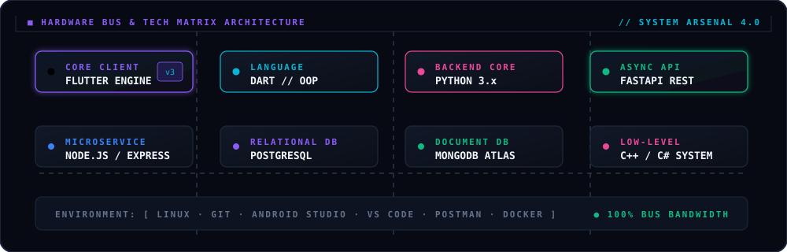
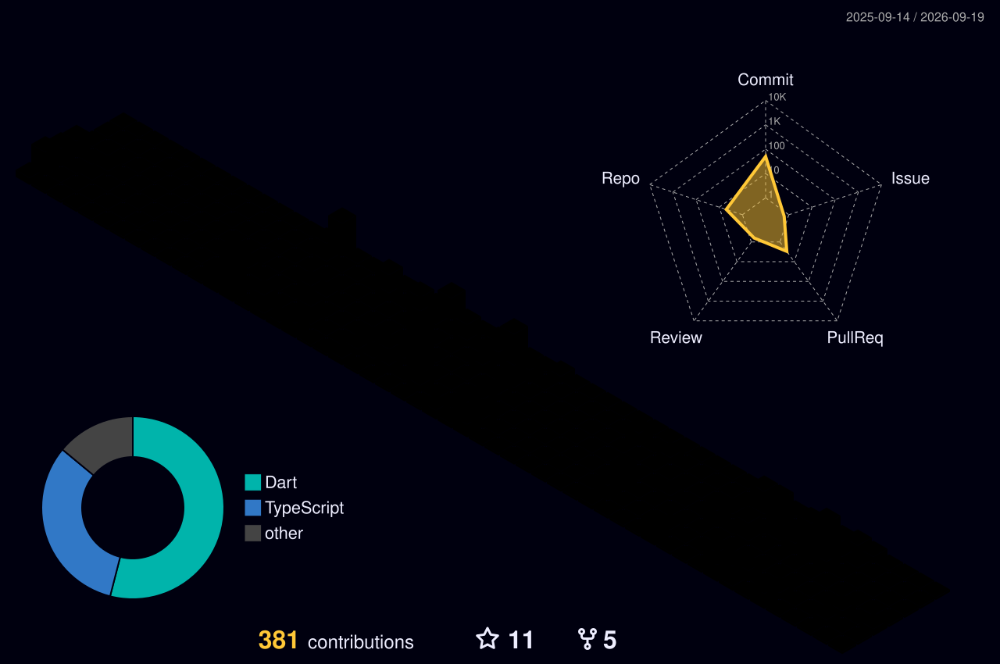
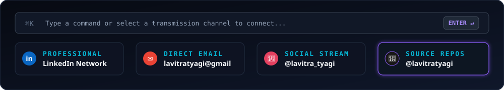

<!-- ========================================================================= -->
<!-- 🌟 BESPOKE LASER-DRAWN VECTOR PORTRAIT & HOLOGRAPHIC HERO DOSSIER         -->
<!-- ========================================================================= -->

  

<!-- Live JetBrains Mono Terminal Typing Stream -->

  

<!-- Live Telemetry Status Pills -->

  
  &nbsp;
  
  &nbsp;
  

 

<!-- ========================================================================= -->
<!-- 🛠️ HARDWARE BUS & BESPOKE TECH MATRIX                                     -->
<!-- ========================================================================= -->

  

 

<!-- ========================================================================= -->
<!-- 🏙️ 3D ISOMETRIC SKYLINE & CONTRIBUTION TELEMETRY                          -->
<!-- ========================================================================= -->

### 🏙️ &nbsp;3D Isometric Skyline &amp; Contribution Telemetry

  <!-- 3D City Skyline (Auto-generated via GitHub Actions) -->
  <picture>
    <source media="(prefers-color-scheme: dark)" srcset="./profile-3d-contrib/profile-night-rainbow.svg">
    <source media="(prefers-color-scheme: light)" srcset="./profile-3d-contrib/profile-night-rainbow.svg">
    
  </picture>

   

  <!-- Stats & Streak Telemetry Grid -->
  <table border="0">
    <tr>
      <td align="center">
        
      </td>
      <td align="center">
        
      </td>
    </tr>
  </table>

   

  <!-- Dynamic Contribution Grid Snake -->
  <picture>
    <source media="(prefers-color-scheme: dark)" srcset="https://raw.githubusercontent.com/lavitratyagi/lavitratyagi/output/github-contribution-grid-snake-dark.svg">
    <source media="(prefers-color-scheme: light)" srcset="https://raw.githubusercontent.com/lavitratyagi/lavitratyagi/output/github-contribution-grid-snake.svg">
    
  </picture>

 

<!-- ========================================================================= -->
<!-- ⌘K TRANSMISSION DOCK & CONNECT HUB                                        -->
<!-- ========================================================================= -->

  

  
<b>Initialize direct transmission or explore networks:</b>

  
  &nbsp;
  
  &nbsp;
  
  &nbsp;
  

 

<!-- Sleek Cyber Wave Divider Footer -->

  

